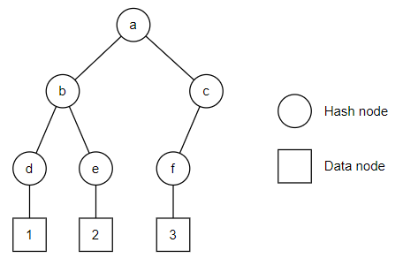
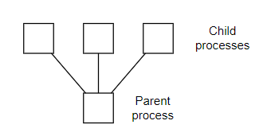

# A Project-based Assignment Package for an Undergraduate Operating Systems Course

## Abstract
Operating Systems is a course that is difficult to teach, as the
concepts are opaque to most people. This paper presents a project-based
assignment package to aid the teaching and learning of the course for
undergraduate students. The assignment package requires the students to
interact with operating system components by implementing a practical
application, reinforcing their understanding of the course material
during the process. The assignment package has a suitable complexity for
undergraduate students and is engaging for students.

Keywords: **Operating Systems, Project-based Learning**

## Introduction

Operating systems are complex. An operating system is an architecture
that comprises many components: scheduling, memory management,
processes, interrupts, synchronization mechanisms, and so on. Each part
is important, and yet opaque to a casual user. Therefore, teaching how
an operating system works is a difficult task. Furthermore, Operating
Systems is a fundamental course in many computer science programs, and
knowledge and skills from the Operating Systems course are essential in
many fields of study and work in computer science and related fields. As
such, it is necessary to develop teaching approaches that allow students
to not only understand operating system concepts but also practice the
use of operating system functionalities in a practical scenario.

Many project-based approaches to teaching Operating Systems involve
students writing code for components in an operating system kernel, or
even writing an operating system from scratch. These approaches have
several problems: their difficulty and workload can be overwhelming for
an undergraduate student, and they may require the students to spend a
lot of time debugging; while they allow students to gain hands-on
experience with the inner workings of operating system components and
algorithms, they do not offer an opportunity for students to experiment
with the mechanics in a practical setting. In addition, many projects
have highly connected components, and without a catch-up mechanism, a
student who fails to complete a previous task may be unable to complete
a later part.

This paper aims to present a project-based assignment package where
students would complete an implementation of a practical application,
namely, a Bitcoin mining simulator. The current implementation of the
assignment package, written in C, contains 5 parts; the first part
ensures students have a C compiling and running environment as well as
basic C programming skills, while subsequent parts each cover a chapter
of the Operating Systems course. For some parts of the assignment
package, students will iteratively build off their solutions from
previous parts, with a catch-up mechanism allowing them to continue with
the assignments even if they did not finish, or performed poorly, on the
prerequisite parts.

Although there are no experimental evaluations of the assignment
package, this paper proposes a method and metrics to evaluate the
effectiveness of the assignment package in practice.

An implementation of the assignment package, including template code and
instructions for students, example solutions, as well as supplementary
information and documentation, can be accessed at
<https://github.com/bl2437-nyu/os-assignment-package>.

## Related Work

There have been various studies on teaching methods and teaching tools
for the Operating Systems course.

[1] and [2] criticize old-fashioned lecture-based
teaching methods, and both propose their improvements. Both studies
have, among other proposals, a significant section involving practical
or experimental teaching, suggesting the importance of hands-on
exercises in Operating Systems teaching.

> [1] W. Qingqiang and C. Langcai, “Teaching mode of operating system course for undergraduates majoring in computer sciences,” in *2009 4th International Conference on Computer Science & Education*, 2009, pp. 1412–1415.
> 
> [2] J. Niu, Z. Hu, and X. Xiao, “Study on curriculum reform of computer operating system,” in *2009 First International Workshop on Education Technology and Computer Science*, vol. 1, 2009, pp. 262–264.

[3] proposes "problem-based learning", and
[4] proposes a "task-driven method", both are
methods centered around class discussions that improve students' ability
to analyze and solve problems. The authors of [3] state that
their method is less efficient compared to traditional lectures, while
[4] states that their method cannot be applied to
all contents in the course material. The present study acknowledges the
merits of said approach but believes that well-designed practical
exercises also achieve the goal of improving problem-solving skills
while being more effective and having better potential coverage of the
course material.

> [3] H. Yi-Ran, Z. Cheng, Y. Feng, and Y. Meng-Xiao, “Research on teaching operating systems course using problem-based learning,” in *2010 5th International Conference on Computer Science & Education*, 2010, pp. 691–694.
> 
> [4] L. Fang and X. Li, “Research application of task-driven method in teaching of the course operating system,” in *2009 International Conference on Education Technology and Computer*, 2009, pp. 164–166.

The most common way to implement practical teaching is to have students
write or modify operating system code, or write or modify a simulation
of operating system features using a high-level language. [5]
implements a simulation of operating system functionalities in Java;
[6] implements an MOS (mini operating system) for use in
an Operating Systems course, with the expectation that students have
mastered Assembly language and C language before the course;
[7] requires students to implement an operating system from
scratch using Assembly and C. [7] notably tests their course
with a group of students; in their test, most students are masters
students, and some students express that "the hands-on labs are too
difficult and too heavy", implying their design was not suitable for
undergraduate students. [2], however, included assignments that
implement operating system components, as well as assignments that
interact with operating system functionalities, in their proposed
improvements to the teaching methods. The present study argues that,
while implementing operating system components can allow students to
gain a deeper understanding of the concepts, it can become
overwhelmingly complex for an undergraduate student, especially when
expecting the students to implement with Assembly language. On the other
hand, practical tasks focusing on using operating system functionalities
are often more suitable for undergraduate students in terms of
complexity, while offering insights on how operating system
functionalities may be used in a practical application, which is much
more useful for the students' future career.

> [5] J. Oh and D. Mosse, “Doritos (distributed object-based real-time instructional operating system): a complete package for teaching principles and practices of real-time operating system,” in *FIE ’98. 28th Annual Frontiers in Education Conference. Moving from ’Teacher-Centered’ to ’Learner-Centered’ Education. Conference Proceedings (Cat. No.98CH36214)*, vol. 1, 1998, pp. 313 vol.1–.
> 
> [6] H. Li, C. Yin, Y. Xu, and Q. Guo, “Construction of the practical teaching system on operating systems course,” in *2010 Second International Workshop on Education Technology and Computer Science*, vol. 1, 2010, pp. 405–408.
> 
> [7] S.-L. Tsao, “A practical implementation course of operating systems: Curriculum design and teaching experiences,” in *2008 14th IEEE International Conference on Parallel and Distributed Systems*, 2008, pp. 768–772.

Regarding tools for teaching Operation Systems courses,
[8] explores the use of visualization tools to help
students understand operation system algorithms; the present study
acknowledges its merits but argues that practical teaching is equally
effective at ensuring students' understanding of the course material.
[9] proposes the use of virtualization software in
the Operating Systems course, focusing on its ability to allow code to
be demonstrated safely in a lecture. Considering the increasing
accessibility of virtualization software over the years, the present
study believes that virtualization software can also be applied in
practical teaching, leveraging the safe and consistent environment that
the virtual machine offers.

> [8] A. Alharbi, F. Henskens, and M. Hannaford, “Integrated standard environment for the teaching and learning of operating systems algorithms using visualizations,” in *2010 Fifth International Multi-conference on Computing in the Global Information Technology*, 2010, pp. 205–208.
> 
> [9] D. Dobrilovic and Z. Stojanov, “Using virtualization software in operating systems course,” in *2006 International Conference on Information Technology: Research and Education*, 2006, pp. 222–226.

The present study aims to mitigate the disadvantages of the
aforementioned works while integrating valuable insights from them with
its proposed solution. More specifically, this paper presents a
project-based teaching tool, in the form of an assignment package,
focused on practical learning, with a suitable complexity such that an
undergraduate student is able to understand the structure and logic of
the project in its entirety.

## Solution

The assignment package involves the students completing an
implementation of a Bitcoin mining simulator, and by the end of the
semester, the students would have a fully functional multi-threaded
application.

### Overview

The assignment package is split up into multiple parts. Part 0 is a
warm-up part that confirms that students have basic C programming
skills, and each subsequent part covers a section of the Operating
Systems course.

A Bitcoin mining simulator is chosen for this assignment package for the
following reasons:

-   Bitcoin mining is, at its core, a relatively simple process to
    understand and implement. This allows the students to focus on
    designing and implementing functionalities required by the
    assignments without spending too much time understanding the Bitcoin
    mining logic.
-   Bitcoin mining is a process that naturally justifies integrating the
    use of operating systems functionalities into the implementation,
    while still keeping the complexity at a manageable level. It is
    computationally expensive yet parallelizable, and requires minimal
    yet crucial inter-process and inter-thread communication, making it
    natural to integrate the use of processes, threads, and
    synchronization in a way that is meaningful but not overly complex.
    Other operating system functionalities can be integrated by
    introducing related processes surrounding Bitcoin mining, for
    example, writing a block or a blockchain to a file would make use of
    file I/O.
-   Real Bitcoin mining applications also make use of various operating
    system functionalities. With an assignment package that implements a
    Bitcoin mining simulator, students are introduced to how operating
    system functionalities may be used in a real-world practical
    application.
-   Bitcoin is a concept that students likely already know about, or
    wish to learn about, allowing the assignments to be relatable and
    possibly more engaging.

Students will be required to install a Linux virtual machine on which to
compile and run all of the assignment code. The instructor should
ideally provide the students with a suitable system image with C
compiling tools pre-installed. Using a virtual machine ensures that
every student has access to a C compiling and running environment, as
well as ensuring that the behavior of the program is consistent across
different devices. The installation and configuration of the virtual
machine can also be seen as a problem-solving exercise for the students,
albeit not explicitly related to the course material.

Students are assumed to have taken Data Structure and Computer
Architecture courses and have basic C programming skills.

### The Bitcoin data structure and related library functions

Throughout the assignment package, students will work with a Bitcoin
data structure that is simplified but still captures the important
components of a real Bitcoin block.

Various utility functions are also provided to students; these functions
abstract many procedures related to Bitcoin and blockchain.

#### `BitcoinBlock` data structure

A `BitcoinBlock` struct used in this assignment package contains two
main parts:

-   A header, which has an identical format as the real Bitcoin's block
    header. Crucially it contains a `nonce` which is modified during the
    "mining" process.
-   A Merkle tree and a number of transactions.
    -   For part 0 ("Warm up"), the tree is represented as a binary tree
        with nodes and pointers. This structure provides a reason for
        the students to use pointers and dynamic memory allocation
        during the assignment.
    -   For subsequent parts, the tree is represented as a fixed-size
        array to fit a limited number of transactions. This avoids the
        use of pointers and makes it easier to store blocks in shared
        memory.

While real blockchains only link to each other by the header hash, this
implementation also includes explicit information on where the previous
and next block is stored. More specifically, each block in the
blockchain is stored in a named shared memory, with its name containing
the block's header's hash. Each block keeps the shared memory name for
its previous and next blocks.

#### Project file structure and library functions

| Header file | Source file | Description |
|-|-|-|
  `bitcoin_utils.h` |  `bitcoin_utils.c` |  Defines the Bitcoin block data structure, and includes functions related to algorithms used by Bitcoin as well as functions closely related to manipulating blocks and blockchains.
  `data_utils.h`   |   `data_utils.c`    |  Contains utility functions related to manipulating data of, or related to, blocks and blockchains.
  `debug_utils.h`   |  `debug_utils.c`    | Contains functions for printing debug info.
  `custom_errors.h`  | `custom_errors.c` |  Defines custom error codes that can be returned by certain functions, as well as a function that prints error messages, similar to `errno` and `perror()` in C standard library.
  `sha2.h`          |  `sha2.c`     |       Enables computation of SHA2 hashes.
  (none)            |  `main.c`           | Entry point for the program. Students will write their code here.
  (none)            |  `makefile`        |  Contain compile instructions for use by the command-line tool `make`.

*Table 1: Description of files included in the code templates.*

Table 1 shows a
summary of files included in the template given to students for certain
parts of the assignment package. Not all parts have a template: students
are expected to modify their solutions for a previous part for some
parts.

The various custom libraries provided implement many operations
involving the Bitcoin blocks, transactions, and blockchains, as well as
some debugging and error-handling functionalities. These help to
abstract and simplify Bitcoin-related operations, allowing students to
focus on knowledge and skills covered in the course material. All
library functions are thoroughly documented, and have a manageable size;
students are able to read through the source files to learn about the
usage and implementations of these library functions.

#### Difficulty for block mining

Real Bitcoin uses a "difficulty" value to determine on average how many
hashing attempts are needed to find a valid nonce; as of the time of
writing this value is set to require around 2x10\^23 hashes. To keep the
mining process practical for a regular home computer, a difficulty value
is chosen that requires on average 1 million hashes to find a valid
nonce, which usually takes a few seconds to compute on a typical laptop
computer. Additional difficulty values with varying average required
hashes are also defined, and students may choose a suitable value should
they find the program running too fast or too slow.

### Part 0 - Warm up

This warm-up section serves many purposes:

-   Instruct students to set up a Linux virtual machine environment and
    C compiling environment, which would be used throughout the entire
    course.
-   Make sure the students have basic skills for working with the C
    programming language. These are of particular importance:
    -   Compiling and running a program using `gcc` and `make`
    -   Manipulation of structs
    -   Manipulation of pointers
    -   Dynamic allocation of memory using `malloc()` and `free()`
-   Introduce the students to the basics of the Bitcoin structure and
    Bitcoin mining.

#### Assignment breakdown

*Fig. 1: A graphical representation of a 3-transaction Merkle tree,
which students are instructed to construct as a part of this
assignment.*

Students will be provided a template. The template contains code that
creates a Bitcoin block and prints its header in a human-readable
format.

Students will be asked to compile and run the code as-is, to confirm
that they have correctly set up their environment and know how to
compile and run a C program.

The students will then be instructed to perform the following tasks:

-   Create a new Bitcoin block object.
-   Create a Merkle tree, as illustrated in
    Figure 1, by creating the nodes and setting
    relevant pointers.
-   Add transactions to the Merkle tree.
-   Using provided utility functions, calculate and update this block's
    Merkle root.
-   Write a loop to compute a valid nonce for the block by brute force
    ("mining").

#### Rationale

For this part, the goal was to create a non-trivial task that covers
basic skills of C programming. Since the rest of the assignment package
is centered around Bitcoin mining, a warm-up task that performs basic
Bitcoin operations is appropriate.

The students are instructed to compile and run the code as the first
task after installing the virtual machine so that if any problems or
difficulties arise, the student would likely have more opportunity to
troubleshoot the problem or find help.

Following that, the students are asked to write code that involves the
creation and manipulation of custom struct types like BitcoinBlock, the
creation and manipulation of pointers, and the use of `malloc()` and
`free()`. This is because these skills are constantly being used
throughout the rest of the assignment package, which means it is best to
make sure that students have mastered the skills. The use of `malloc()`
and `free()` would also give students a subtle introduction to memory
management.

The students are then asked to write a brute force loop to mine the
Bitcoin block. This brute force loop will appear in all subsequent parts
of the assignment package, and students would need to modify the loops
to insert various functionalities; it would be beneficial to ensure
students' understanding of the basics of the process. At this point, the
students also have an opportunity to gauge their device's computing
power and choose a different difficulty value if needed.

Throughout this assignment, students are also encouraged to read source
and header files for the provided libraries for definitions and
documentation of custom types, values, and utility functions, as well as
understand the compilation of a multi-file C program by examining the
file structure and the `makefile` file.

### Part 1 - Processes

This part covers the "processes" chapter of the Operating Systems
course.

Students will be tested on the following skills:

-   Creating child processes using `fork()`.
-   Using the return value of `fork()` to distinguish between the parent
    process and the child processes.
-   Using `getpid()` and `wait()`.

Considering semaphores and shared memories have not been introduced yet,
the template includes code that allows the processes to communicate via
signals, where upon receiving a `SIGUSR1` signal, a child process will
exit, aborting the task that it is doing. Since signal-related APIs are
not taught in the course, relevant code is mostly included in the
template code, with an explanation of how to use `kill()` provided in
the assignment instructions.

#### Assignment breakdown

*Fig. 2: A graphical representation of the processes in part 1 and in
part 2, question 1*

Students will be given a template. The template code creates a random
Bitcoin block and sets up signal handlers.

Students will be instructed to perform the following tasks:

-   Using `fork()`, create several child processes.
-   Write logic that distinguishes between the parent process and the
    child processes in an `if` statement.
-   For the parent process, use `wait()` to wait for the first child
    process that completes its task and exits. Then, use `kill()` to
    send signals to the other processes, and wait for them to terminate
    as well.

Figure 2 shows a graphical representation of the
relationship between processes created in this part.

#### Rationale

In the context of Bitcoin mining, once a process, thread, or perhaps
another Bitcoin miner on the network, has successfully mined a block and
attached it to the blockchain, other processes, threads, or miners
should ideally stop and prepare to mine the next block. Thus, if we
simply instructed the students to create child processes to run the
brute force loop and exit when they find a valid nonce, it would be less
optimal in the context. However, synchronization tools such as shared
memory and semaphores have not yet been introduced to the students in
this chapter.

This assignment package approaches this problem with a combination of
`wait()` and signals. The parent process can `wait()` for a single
process to exit (this process would be the one process that finishes
first), and send a signal to the rest of the processes. This
implementation would require the students to record the PIDs returned
from `fork()` and then compare them with the PID returned from `wait()`.

An earlier idea involved the parent process obtaining a nonce value from
a child process via the exit code. However, only one byte of information
can be obtained this way, which made this idea infeasible. Nevertheless,
this idea might prove useful should a similar assignment package be
designed with a different application.

While signals are an important part of an operating system, the use of
signals and signal handlers in C programming is not covered in the
Operating Systems course at NYU Shanghai. Thus, this assignment package
provides students with all signal-related code within the template and
introduces the use of `kill()` in the assignment instructions. Should
this assignment package be used in an institution where the use of
signals is covered in the curriculum, the assignment can easily be
modified so that students need to write the code for signal handlers.

### Part 2, question 1 - Synchronization with semaphores and shared memory

This part covers the "synchronization" chapter of the Operating Systems
course.

Students will be tested on the following skills:

-   Creating, referencing, and unlinking POSIX semaphores and shared
    memories.
-   Using semaphores and shared memories to synchronize the processes.

#### Assignment breakdown

Students will be given a template. The template contains most of the
code for a multi-process Bitcoin mining simulation. However, any
synchronization logic has been left out of the template and requires the
students to implement it.

Students will be instructed to implement synchronization between the
parent and child processes. The program must be able to mine and attach
multiple blocks without needing to terminate and re-create child
processes.

#### Rationale

While testing early implementation ideas, it is discovered that it is
too trivial to simply require all child processes to exit once one has
reached a valid nonce - this requires a single boolean value in shared
memory. As an attempt to make a non-trivial assignment that requires the
use of semaphores, this assignment requires the program to process
multiple blocks without having the child processes exiting. This can be
justified in the context of the application as avoiding the overhead of
creating additional processes.

The example solution for this assignment uses two semaphore-based
barriers to control execution order and one mutex to control write
access to the shared memory. Students might be able to produce different
implementations.

### Part 2, question 2 - Synchronization across multiple terminal windows

This is a variation on part 2, question 1. Instead of multiple child
processes of a single parent process running alongside each other, this
question will have the student run multiple instances of the program
from multiple terminal windows.

#### Assignment breakdown

Similar to Part 2, question 1, students will be given a template that
contains most of the code but without synchronization logic. Students
will be instructed to implement the synchronization logic between
instances of the program.

#### Rationale

Despite not testing different skills compared to question 1, this
question allows students to understand that named semaphores and named
shared memories can be accessed by processes on the same operating
system even if they do not share a common parent process. Students might
also discover during the assignment that it is best practice to use a
name for shared memories and semaphores that is unlikely to collide with
names used by a different program.

Since it takes time for students to open multiple instances of the
program in multiple terminal windows, and the program has no knowledge
of the number of instances open, the template contains code that allows
the student to type in the number of instances opened, and a barrier
that releases all instances at once. Instructors may consider modifying
this template code and instruct students to find a solution to this
problem as a problem-solving challenge.

### Part 3 - Threads

This part covers the "threads" chapter of the Operating systems course.

Students will be tested on the following skills:

-   Creation of POSIX threads using `pthread_create()`
-   Exiting a thread using `pthread_exit()`
-   Waiting for threads to terminate using `pthread_join()`
-   Synchronization of the parent process, child processes, and threads
    of child processes

While not required, students may also decide to use other POSIX threads
APIs such as `pthread_mutex`.

#### Assignment breakdown

*Fig. 3: A graphical representation of the processes and threads in
part 3.*

Unlike previous parts, students will complete this assignment by editing
their solution from part 2, question 1. Students may request a copy of
an example solution from part 2, question 1 as a template from their
instructor, should they fail to complete that part.

Students will be instructed to update the child processes' code to
create threads and have the threads perform the task of "mining" the
Bitcoin blocks.

Figure 3 shows a graphical representation of the
processes and threads created in this part.

#### Rationale

This is the first assignment where students are expected to iterate upon
their previous solution. This allows students to experience the
iterative development process, a process commonly employed in real-world
development. However, students may decide to ask their instructor for a
copy of the previous part's sample solution as a template, if they did
not finish the previous assignment or were unsatisfied with their
previous solution. It is at the discretion of the instructor whether to
provide the sample solution.

Unlike part 2, question 1 where students were instructed not to
terminate and re-create processes between blocks, this part does not
enforce the same for threads. This is because the communication between
threads from different processes is already a complex task. This can
also be justified in the context of the application as threads require
less overhead to create than processes.

### Part 4 - Files

This part covers the "file management" chapter of the Operating Systems
course.

Students will be tested on the following skills:

-   Opening, closing, reading from, and writing to files, using
    `open()`, `close()`, `read()`, and `write()`.

#### Assignment breakdown

Students will complete this assignment by editing their solution from
part 3. Students may request a copy of an example solution from part 3
as a template from their instructor, should they fail to complete that
part.

Students will be instructed to update the code so that:

-   When a block is mined and attached to the blockchain, write the
    blockchain's data to a file. The write operation must not overwrite
    previously-written files, thus requiring a naming scheme to give
    each file written a unique name, and a metadata file containing the
    name of the most recently written file.
-   When the program starts, try to read the metadata file, then the
    file with the name saved in the metadata, and load the blockchain
    data within into memory if it exists.

#### Rationale

Writing a blockchain to a file involves serialization and
deserialization of binary data. While it could have been a good
problem-solving challenge, asking students to design and implement a
serialization scheme is rather complex and is ultimately a distraction
from the course material. With that in mind, the reading and writing of
a blockchain from or to a file have been packaged in two library
functions, where students provide a file descriptor for the file
involved. The students are still required to write code for reading from
or writing to the metadata file.

The requirement for a naming scheme that provides unique names is also a
minor problem-solving challenge, with potentially multiple different
approaches that the students can take.

The use of a metadata file to store information about other files is
also a practice that can be found in real-world applications.

## Results and Discussion

### Results

The assignment package proposed by this paper for the Operating Systems
course has the following characteristics:

-   **It emphasizes practical applications of operating system
    components.** Having students implement practical applications as
    assignments allows students to better understand how their course
    material may be applied in a real-world scenario, which is valuable
    for the student's future career. Existing approaches where students
    implement operating system algorithms or solve theoretical problems
    while allowing students to have a deeper understanding of the
    operating system components, fail to introduce the practical uses of
    the components.
-   **Its difficulty and workload are suitable for an undergraduate
    student.** This assignment package uses the C programming language,
    a high-level language, which is much more manageable by an
    undergraduate student compared to assembly language. The library
    code is relatively small in size (approximately 1 000 lines of code,
    excluding `sha2.c` and `sha2.h`), allowing students to have a full
    understanding of the material they are provided with, in contrast to
    an operating system kernel which can have too much code for a
    student to understand, leaving a large portion of the material
    opaque to the student. Much of the Bitcoin-related operations are
    abstracted as library functions, reducing unnecessary complexity for
    the students.
-   **It has a catch-up mechanism.** For parts where students are
    expected to modify their solutions from a previous part, if a
    student failed to complete the previous part, is unsatisfied with
    their previous solution, or otherwise finds difficulty modifying
    their previous code, they may request a template to modify for this
    part of the assignment. This can mitigate the cascading consequences
    of the student's previous mistakes.
-   **It encourages problem-solving and creative thinking.** Students
    are required to solve various practical problems throughout the
    assignment package, whether related to the course material or not.
    Additionally, many tasks in the assignment package, as well as many
    library functionalities, have multiple different ways to approach;
    the students may be encouraged to compare the advantages and
    disadvantages of different designs and implementations.
-   **It is relatable and engaging.** Throughout the course, the student
    would implement a fully functional Bitcoin mining simulator. Bitcoin
    and Bitcoin mining is a topic that students likely know about;
    students are likely to find the assignments relatable and the
    results rewarding.

### Evaluation

Limited by the timeline of this project, an evaluation by experiments
was not possible. If an experiment were to be conducted, the following
methodology could be used:

A control group experiment would be conducted, where one class of
Operating Systems students would receive traditional homework
assignments for one semester as a control group, and another class of
Operating Systems students would receive a modified set of assignments
that includes this assignment package in the following semester as an
experiment group.

A pre- and post-test could be used to evaluate the effectiveness of the
assignment package in helping the students to understand the course
material. A pre-test would be administered as a survey during or before
the first lecture, or the instructor could verbally ask students about
their knowledge of Operating Systems concepts during the first lecture.
A post-test result would be taken from both the students' mid-term exam
and final exam scores, as well as their performance in the assignment
submissions. The pre- and post-test results would be compared to assess
students' performance under their respective conditions.

In addition, qualitative feedback would be collected from the students.
Surveys and interviews would be conducted, and students would be
encouraged to submit written feedback alongside their assignment
submissions. This feedback would be used to assess the quality of the
assignments and student engagement.

Some of the questions that could be asked during a survey or interview,
or be instructed students to write in feedback alongside their
assignment submissions, could include:

-   How difficult was the assignment? What was/were the main
    difficulty(-ies)?
-   Were the assignment prompt and code template clear and easy to
    understand? Were they helpful?
-   Did you try to read the code in the provided libraries? How well did
    you understand it?
-   Are the assignments, or certain parts of them, interesting? Are
    there parts that made you consider factors beyond the requirements
    of the assignments?
-   Did the assignments help you understand, or help you reinforce your
    knowledge of, the course material?

### Discussion

Despite the advantages of the assignment package, there are significant
limitations that need to be addressed:

-   **It does not cover all the chapters in the course.** The current
    implementation of the assignment package covers processes,
    synchronization (using semaphores and shared memories), threads, and
    files. This still leaves significant portions of the course
    unaccounted for, such as scheduling, memory management, and
    networking. While certain chapters can be more easily integrated
    into the assignment package, others might be more difficult to
    incorporate. The following are potential avenues for expansion that
    are yet to be implemented:
    -   Networking can be incorporated by requiring the program to
        communicate with other programs to simulate a Bitcoin network.
        The implementation may be decentralized like the real Bitcoin,
        or may be modified to use a server-client model for simplicity.
    -   Memory management can be simulated by arranging transaction data
        in a byte array in the Bitcoin block structure. Instead of using
        memory locations or C pointers, indexes into the byte array
        would be used to refer to a location in the array instead.
-   **It does not cover edge-case scenarios and does not cover all the
    details in the course material.** Implementation of a practical
    application is likely to take the least resistant path, which can
    leave part of the course material unaccounted for in the
    assignments. For example, when implementing reading and writing of
    files, a student is unlikely to implement in a way where multiple
    processes write to the same file at the same time, nor is it likely
    to use `dup()` to duplicate a file descriptor. However, these
    edge-case scenarios and functionalities can still be important for
    students to understand. As such, this assignment package should not
    be used on its own, instead, it should be used in conjunction with
    other practice questions, lab exercises, or assignments that account
    for the missing parts. It may be possible to improve the design of
    the assignment package to improve the coverage of these details.

A minor challenge during the design and implementation process of this
assignment package is to navigate the various requirements, goals, and
technical limitations, all of which place limitations on how the package
can be implemented. Some of the requirements are that the assignments
have to cover the course material while still feeling natural within the
context of the Bitcoin mining simulator; they have to be challenging but
not overwhelming; the library code has to be relatively robust. Some
technical limitations include the inability to use pointers inside
shared memory, which also conflicts with the warm-up part's requirement
to incorporate pointers. While none of these caused severe difficulties
during the design and implementation process, they did require
additional consideration, and sometimes multiple iterations of different
implementations; notably, the Bitcoin block structure has undergone 5
iterations so far.

During the course of this project, the author has been made aware of
alternative applications to theme this assignment package around. Some
of these applications include a file system simulator, a multi-threaded
web server, or a database server. However, each of these applications
has properties that make them unsuitable for this assignment package,
for example, a file system simulator is much more limited in scope and
does not cover all chapters of the course material; a web server
requires parts of the assignment to be in a different order as the
course material, with networking required near the beginning, while also
being less compatible with an iterative development process that this
paper aims to implement. The author believes that a Bitcoin mining
simulator remains an optimal selection for this assignment package.

## Conclusion

This paper proposes a project-based assignment package for an
undergraduate Operating Systems course, where students implement a
Bitcoin mining simulator using various operating system concepts. The
assignment package allows students to gain an understanding of how
operating system functionalities may be applied in a practical scenario,
with a workload and difficulty suitable for undergraduate students. The
assignment package addresses a gap in project-based teaching tools
suitable for undergraduate students.

The current implementation contains 5 parts, covering 4 chapters of the
Operating Systems course. Code templates and custom libraries are
provided to students to manage the complexity of the assignments. Some
parts of the assignments require students to incrementally iterate on
their previous solutions, and a catch-up mechanism is provided for
students that fail to complete a previous assignment.

While it does not currently cover all chapters of the course nor does it
cover every detail in a chapter, it has potential to be expanded and
improved. An experiment to evaluate the assignment package's
effectiveness in a teaching environment was not performed, but an
appropriate methodology for evaluation was presented.
